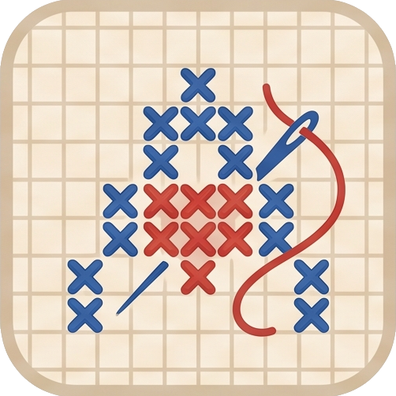

# 🧵 Across Stitch

<p align="center">
  
</p>

<p align="center">
  <strong>A modern, cross-platform Pixel Art & Cross-Stitch companion.</strong><br>
  Designed for <strong>Raspberry Pi Servers</strong>, <strong>PC Desktop (Electron)</strong>, <strong>Web (PWA)</strong>, and <strong>Android</strong>.
</p>

---

## 🌟 Highlights

- **🧵 Non-Destructive Pixel Art Editing**: Import any pixel art or PNG image, recolor threads project-wide without modifying the original source image, and inspect colors with the eyedropper tool.
- **✨ Dynamic Completed Stitches**: Mark or erase stitches by clicking or dragging. Choose your stitch style (`Translucent Tint`, `Cross Stitch ✕`, `Solid Fill`, `Center Dot`) and customize marker color and opacity in real time.
- **🖼️ Detached Floating Reference Window**: Detach your canvas into a floating, Always-On-Top micro-window. Supports right-click drag panning, drag-to-stitch, opacity cycling (100% / 85% / 65%), and collapsible toolbars (<kbd>Tab</kbd> / <kbd>H</kbd>) for a pure canvas overlay while working.
- **🍓 Raspberry Pi & LAN Server**: High-performance Bun + SQLite backend server with auto-seeding, REST API, CORS, and a ready-to-use `systemd` background service for 24/7 headless deployment on your local network.
- **📱 Android App & PWA**: Mobile-optimized touch interface, adaptive launcher icons, PWA manifest, and Android Studio Jetpack Compose WebView client.
- **🎨 Modern Neutral UI**: Sleek dark/light theme, custom slim scrollbars, collapsible palette sidebar, and customizable canvas fabric/background color (supports transparent PNGs).

---

## 📱 Platform Architecture

```
                               ┌────────────────────────────────┐
                               │  🍓 Raspberry Pi / LAN Server  │
                               │  (Bun + SQLite :3000)          │
                               └───────────────┬────────────────┘
                                               │
               ┌───────────────────────────────┼───────────────────────────────┐
               ▼                               ▼                               ▼
    ┌────────────────────┐          ┌────────────────────┐          ┌────────────────────┐
    │   💻 PC Desktop    │          │  🌐 Web Browser    │          │   📱 Android App   │
    │   (Electron App)   │          │  (PWA / Web Client)│          │ (Native / WebView) │
    └──────────┬─────────┘          └────────────────────┘          └────────────────────┘
               │
               ▼
    ┌────────────────────┐
    │ 🪟 Detached Window │
    │ (Always-On-Top)    │
    └────────────────────┘
```

---

## 🚀 Quick Start

### Prerequisites
Make sure [Bun](https://bun.sh) is installed on your system:
```bash
curl -fsSL https://bun.sh/install | bash
```

### 1. Running Locally (Development)

Clone the repository and install dependencies:
```bash
git clone https://github.com/redystum/ACross-Stich.git
cd across_stich
bun install
```

Start the local server:
```bash
bun run dev
```
Open **`http://localhost:3000`** in your browser.

---

## 💻 PC Desktop App (Electron)

Launch the desktop client with native Always-On-Top detached window support:
```bash
bun run pc
```

### Features of the PC App:
- **Detached Window**: Click the **Detach** button in the bottom toolbar to pop out the artwork into a floating Always-On-Top window.
- **Right-Click Drag**: Hold right-click or middle-click to pan around smoothly.
- **Drag to Stitch**: Hold left-click and drag across pixels to stitch in a continuous stroke.
- **Hide/Show Bars**: Click the header collapse button or press <kbd>Tab</kbd> / <kbd>H</kbd> in the detached window for a pure canvas overlay.
- **Opacity Cycling**: Click the opacity button to toggle transparency (100% → 85% → 65%) to see reference material underneath.
- **Server Connection**: Click the **🍓 Raspberry Pi** button in the top bar to connect to your remote LAN server.

---

## 🍓 Raspberry Pi Server Deployment

Run Across Stitch 24/7 on your home Raspberry Pi or Linux home server.

### 1. Copy Files to Raspberry Pi
```bash
scp -r server pi@raspberrypi.local:~/across_stitch/
scp -r public pi@raspberrypi.local:~/across_stitch/
```

### 2. Run Directly
```bash
cd ~/across_stitch/server
bun run server.ts
```

### 3. Run as a Background Service (Auto-Start on Boot)
Across Stitch includes a pre-configured `systemd` service file:

```bash
# 1. Copy service file to systemd
sudo cp ~/across_stitch/server/across-stitch.service /etc/systemd/system/

# 2. Reload and enable service
sudo systemctl daemon-reload
sudo systemctl enable --now across-stitch

# 3. Check status & logs
sudo systemctl status across-stitch
journalctl -u across-stitch -f
```

---

## 📱 Android Client

### Option 1: Mobile Web / PWA
Connect your phone to the same Wi-Fi network and open `http://<SERVER_IP>:3000`. You can tap **"Add to Home Screen"** in Chrome/Firefox to install it as a standalone PWA with custom icons and splash screen.

### Option 2: Android Studio App
Open the `android/` directory in Android Studio:
1. Build and install the APK on your device or emulator.
2. The app includes edge-to-edge system bar support, touch gestures (pinch-to-zoom & two-finger pan), and a built-in server IP connection dialog.

---

## ⌨️ Controls & Keyboard Shortcuts

| Shortcut | Context | Action |
|---|---|---|
| `Left Click + Drag` | PC / Detached | Stitch or erase pixels along stroke |
| `Right Click + Drag` | PC / Detached | Pan / move the canvas |
| `Middle Click + Drag` | PC / Detached | Pan / move the canvas |
| `Scroll Wheel` | PC / Detached | Zoom in / out at cursor position |
| `Tab` or `H` | Detached Window | Toggle header and bottom bar visibility |
| `F` | PC / Detached | Fit artwork to window |
| `G` | PC / Detached | Toggle stitch grid overlay |
| `M` | Main App | Activate Stitch Tool |
| `E` | Main App | Activate Erase Tool |
| `I` | Main App | Activate Eyedropper / Color Picker |
| `P` | Main App | Activate Pan / Move Tool |
| `Ctrl + S` / `Cmd + S` | Main App | Save project to server |
| `Single Touch + Drag` | Mobile / Android | Pan canvas smoothly |
| `Tap` | Mobile / Android | Mark or toggle stitch |
| `Pinch` | Mobile / Android | Smooth pinch-to-zoom |

---

## 🛠️ Available Scripts

| Command | Description |
|---|---|
| `bun run dev` | Run root web server in live watch mode |
| `bun run pc` | Launch the Electron PC desktop application |
| `bun run server` | Start the standalone Raspberry Pi server |
| `bun run server:dev` | Start the standalone server in watch mode |

---

## 📄 License

[MIT License](LICENSE) — Feel free to use, modify, and distribute for personal and commercial projects.
